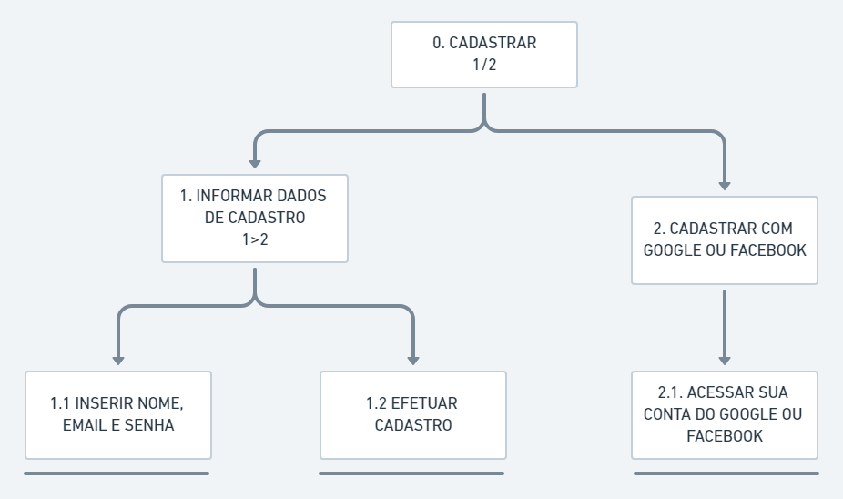
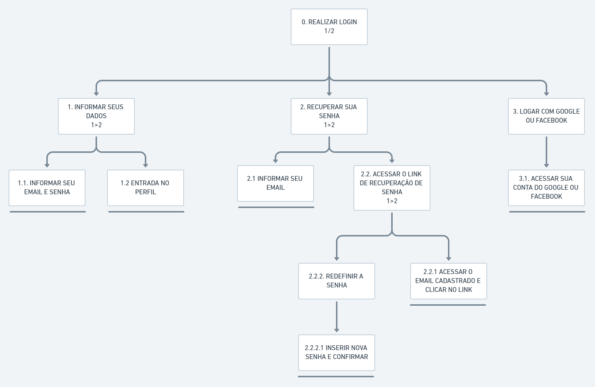

# Análise hierárquica de visualização
A  idéia  básica  desta  análise  é  relacionar  o que  as  pessoas  fazem  (tarefas), por que o fazem e quais as conseqüências, caso não façam corretamente. O ponto de partida desta análise são os objetivos do usuário. A partir de um objetivo, as principais tarefas associadas ao alcance deste objetivo são identificadas. Neste contexto, uma tarefa pode ser vista como qualquer parte do trabalho que precisa  ser  realizada –  um plano,  ou  seja,  são  os  subobjetivos  de  um  objetivo.
O  objetivo que  não possui  nenhum  subobjetivo  (tarefa  não  mais  decomposta)  é denominado operação –  unidade  fundamental  em  AHT.  A  representação  gráfica  de objetivos/tarefas  é  um  retângulo, assim   como   tarefas   que   não   são   mais   decompostas,   ou   seja,   operações,   são representadas por retângulos com uma linha horizontal sob o mesmo. As relações entre os subobjetivos possuem a representação apresentada a seguir:

## Cadastro
O diagrama AHT a seguir apresenta o cadastro para o nosso projeto:

Abaixo a representação do diagrama anterior em forma de tabela:

|Objetivos/Operações|Problemas e Recomendações|
|-|-|
|0. Cadastrar 1/2|*Input:* email e senha. *Plano:* informar dados de cadastro e depois permitir que acesse a conta. |
|1. Informar dados de cadastro 1>2|*Input:* email e senha. *Plano:* informar dados de cadastro e depois permitir que acesse a conta. |
|1.1. Inserir nome, email e senha|*Input:* email e senha. *Plano:* informar dados de cadastro. |
|1.2. Efetuar cadastro|*Plano:* acessar a conta com os dados informados. |
|2. Cadastrar com google ou facebook|*Input:* email e senha do google/facebook. *Plano:* informar dados de cadastro a partir do google ou facebook e depois permitir que acesse a conta. |
|2.1. Acessar sua conta do google ou facebook|*Input:* email e senha. *Plano:* acessar a conta com dados do google ou facebook. |
## Login
O diagrama AHT a seguir apresenta o login para o nosso projeto:

Abaixo a representação do diagrama anterior em forma de tabela:
|Objetivos/Operações|Problemas e Recomendações|
|-|-|
|0. Realizar Login 1/2|*Input:* email e senha. *Plano:* informar dados de login e depois permitir que acesse a conta. |
|1. Informar seus dados 1>2|*Input:* email e senha. *Plano:* informar dados de login. |
|1.1. Informar seu email e senha|*Input:* email e senha. *Plano:* informar dados de login. |
|1.2. Entrada no perfil|*Plano:* acessar a conta com os dados de login. |
|2. Recuperar sua senha 1>2|*Input:* email. *Plano:* informar email e depois enviar um link de recuperação de senha, acessar o link e por último inserir nova senha e confirmar. |
|2.1. Informar seu email|*Input:* email. *Plano:* informar seu email e depois enviar link de recuperação de senha. |
|2.2. Acessar o link de recuperação de senha 1>2|*Plano:* acessar o link e depois inserir nova senha e confirmar. |
|2.2.1. Acessar o email cadastrado e clicar no link|*Plano:* acessar o link pelo email cadastrado e depois inserir nova senha e confirmar. |
|2.2.2. Redefinir a senha|*Plano:* inserir nova senha. |
|2.2.2.1. Inserir nova senha e confirmar|*Plano:* inserir nova senha e confirmar. |
|3. Logar com o google ou facebook|*Input:* email e senha do google ou facebook. *Plano:* informar dados de login do google ou facebook e depois acessar a conta. |
|3.1. Acessar sua conta do google ou facebook|*Plano:* acessar a conta com od dados de login do google ou facebook. |
## Visualizar informações de uma cidade
Os diagramas AHT a seguir apresentam como visualizar as informações de uma cidade no nosso projeto:

Abaixo a representação do diagrama anterior em forma de tabela:

|Objetivos/Operações|Problemas e Recomendações|
|-|-|
|0. Visualizar informações de uma cidade|*Plano:* informar dados da cidade escolhida. |
|1. Selecionar continente 1>2|*Input:* continente. *Plano:* selecionar continente. |
|1.1. Clicar no continente com o nome desejado|*Input:* continente. *Plano:* selecionar continente desejado. |
|1.2. Selecionar país 1>2|*Input:* país. *Plano:* selecionar país desejado. |
|1.2.1. Clicar no país com o nome desejado|*Input:* país. *Plano:* selecionar país desejado. |
|1.2.2. Selecionar cidade 1>2|*Input:* cidade. *Plano:* selecionar cidade desejada. |
|1.2.2.1. Clicar na cidade com o nome desejado|*Input:* cidade. *Plano:* selecionar cidade desejada. |
|1.2.2.2.Visualizar informações da cidade 1+2|*Input:* cidade. *Plano:* visualizar informações da cidade. |
|1.2.2.2.1. Visualizar descrição|*Plano:* visualizar descrição da cidade. |
|1.2.2.2.2. Visualizar melhores restaurantes, bares|*Plano:* visualizar os melhores restaurantes e bares da cidade selecionada. |
|1.2.2.2.3. Visualizar histórico da cidade|*Plano:* visualizar histórico da cidade. |
|1.2.2.2.4. Visualizar melhores pontos turísticos|*Plano:* visualizar melhores pontos turísticos da cidade. |
|1.2.2.2.5.  Visualizar melhores épocas do ano|*Plano:* visualizar melhores épocas do ano da cidade. |
|1.2.2.2.6. Converter a moeda utilizada na cidade|*Input:* quantia desejada e moeda desejada. *Plano:* informar a quantidade de dinheiro a ser convertido de qual moeda para qual moeda e visualizar o resultado. |
|1.2.2.2.6.1. Inserir a quantia a ser convertida 1+2|*Input:* quantia a ser convertida. *Plano:* informar a quantidade de dinheiro a ser convertido. |
|1.2.2.2.6.1.1. Digitar no campo o dinheiro a ser convertido|*Input:* quantia de dinheiro. *Plano:* informar a quantidade de dinheiro a ser convertido. |
|1.2.2.2.6.1.2. Selecionar a moeda que deseja converter para a moeda do local selecionado|*Input:* moeda a ser convertida. *Plano:* informar a moeda a ser convertido. |
|1.2.2.2.6.1.3. Visualizar a quantia na moeda do local selecionado |*Plano:* visualizar a conversão da moeda selecionada para a local. |
## Visualizar insígnias
Os diagramas AHT a seguir apresentam como visualizar as insígnias no nosso projeto:

Abaixo a representação do diagrama anterior em forma de tabela:

|Objetivos/Operações|Problemas e Recomendações|
|-|-|
|0. Visualizar insígnias|*Plano:* visualizar insígnias. |
|1. Realizar Login|*Input:* email e senha. *Plano:* informar dados de login e depois permitir que acesse a conta. |
|2. Acessar perfil 1>2|*Plano:* acessar o perfil. |
|2.1. Clicar na opção "meu perfil"|*Plano:* acessar o "meu perfil" e visualizar suas opções. |
|2.2. Selecionar insígnias 1>2|*Plano:* selecionar insígnias. |
|2.2.1. Visualizar insígnias 1>2|*Plano:* visualizar todas as insígnias já adquiridas. |
|2.2.1.1. Clicar na insígnia|*Plano:* selecionar a insígnia específica que quer visualizar. |
|2.2.1.1.1. Visualizar descrição da insígnia|*Plano:* visualizar informações da insígnia. |

