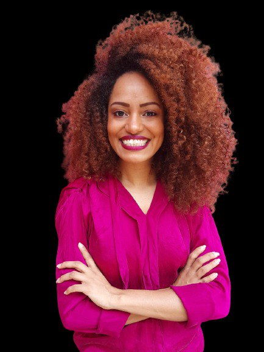
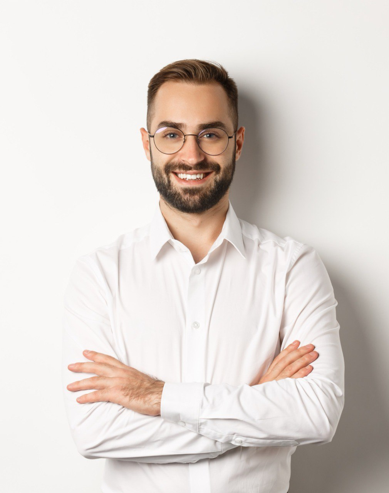
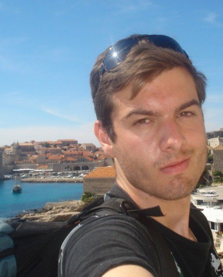
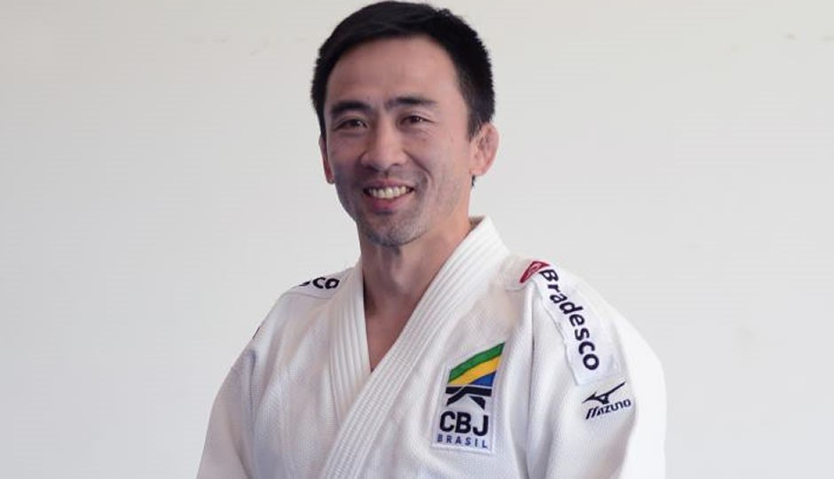

# Documento de visão

|Data|Versão|Descrição|Autor|
|-|-|-|-|
|18/08/2021|0.1|Adicionado template e tópicos 1, 2, 3, 4, 5, 6, 7, 8 e 9|Cibele|
|19/08/2021|0.2|Separando o documento em partes menores (retirando tópicos 2.2, 8 e 9), adicionando texto no tópico 4|Cibele|
|30/08/2021|0.3|Adicionando tópico 5, 5.1, 5.2, 5.3, 5.4, 5.5|Cibele|

### Índice Analítico
* [1. Introdução](#1-introdução)
    * [1.1. Objetivos do projeto](#11-objetivos-do-projeto)
    * [1.2. Desenvolvedores](#12-desenvolvedores)
* [2. Visão geral do produto](#2-visão-geral-do-produto)
    * [2.1. Declaração de posição do produto](#21-declaração-de-posição-do-produto)
* [3. Ferramentas, ambiente e infraestrutura](#3-ferramentas-ambiente-e-infraestrutura)
    * [3.1. Hardware](#31-hardware)
    * [3.2. Software](#32-software)
* [4. Metodologia](#4-metodologia)
    * [4.1. Metodologia de design](#41-metodologia-de-design)
* [5. Personas](#5-personas)
    * [5.1. Yasmin](#51-yasmin)
    * [5.2. André](#52-andré)
    * [5.3. Josefina](#53-josefina)
    * [5.4. Menezes](#54-menezes)
    * [5.5. Kenji](#55-kenji)
* [6. Cronograma](#6-cronograma)
* [7. Matriz de comunicação](#7-matriz-de-comunicação)

## 1. Introdução
### 1.1. Objetivos do projeto
Esse projeto tem como objetivo desenvolver e consolidar o conhecimento dos alunos integrantes do time de Interação humano-computador através do desenvolvimento prático dos ensinamentos da disciplina. 
Esse processo de desenvolvimento, tem como entrega final, cuja data limite é a data de apresentação final do projeto, um protótipo de alta fidelidade do aplicativo *nome* e as análises dos testes de interação com o usuário.   
### 1.2. Desenvolvedores
|Nome||Função||
|-|-|-|-|
|Cibele Goudinho||Desenvolvedora|
|Gabriel Sabanai||Desenvolvedor|
|Victor Buendia||Desenvolvedor|
|Arthur Talles||Desenvolvedor|
|Antônio Neto||Desenvolvedor|
|Davi Matheus||Desenvolvedor|
|Felipe Agustini||Desenvolvedor|

## 2. Visão Geral do produto
### 2.1. Declaração de posição do produto
|Declaração|Descrição|
|-|-|
|Para|Viajantes de qualquer idade|
|Quem|Possuem dificuldades em achar atividades e informações sobre as cidades às quais está visitando|
|O *nome*|É um aplicativo mobile|
|Que|Permite visualizar o destino do usuário e fornece informações e também possíveis pontos de interesse sobre o lugar |
|Ao contrário|Do Maps, mapas tradicionais e Airbnb |
|Nosso produto|Traz curiosidades sobre os locais catalogados no aplicativo, sugere os melhores pontos de interesse das cidades, traz conversão da moeda do usuário para a moeda do lugar visitado e fornece um sistema de conquista e insígnias |

## 3. Ferramentas, ambiente e infraestrutura

### 3.1. Hardware
|Perfil|Tipo de Hardware|Configurações|Quantidade planejada|
|-|-|-|-|
|Todos os perfis planejados|Computador|i5 6º geração 4GB de RAM|07

### 3.2. Software
|Perfil|Tipo de Software|Nome da ferramenta|Versão|
|-|-|-|-|
|Todos os perfis planejados|Ferramenta de versionamento de código|Git|2.25.1
|Todos os perfis planejados|Repositório para código e documentação|Github|-
|Todos os perfis planejados|Compartilhamento de arquivos|Google Drive|-
|Todos os perfis planejados|Ferramenta de comunicação do time e envio de avisos|Telegram|2.8.8
|Todos os perfis planejados|Plataforma de quadro branco colaborativo|Miro|-
|Todos os perfis planejados|Aplicativo para comunicação síncrona|Teams|-
|Todos os perfis planejados|Plataforma para prototipação|Figma|-

## 4. Metodologia
### 4.1. Metodologia de design
Esse Processo de Design, proposto por Hix e Hartson em 1993, tem como o principal diferencial a constante avaliação, ou seja, entre todas as etapas do ciclo de vida do projeto é realizada uma análise do que foi feito, caso não esteja satisfatório, retornamos para as etapas anteriores e melhoramos.
Esse foi o processo escolhido pelo time, por ser bastante versátil e eficiente em IHC. Além de que, comparado com o modelo de Mayhew, permite que o time escolha a ordem de execução dos processos trazendo flexibilidade e permitindo que a equipe siga o primeiro cronograma sem precisar de reformulações. 

Esse processo segue a seguinte lógica:

**Análise de tarefas, usuários e funções:** é quando se toma consciência da situação atual, das necessidades e oportunidades de melhora.

**Especificação de requisitos:** define-se o problema e os requisitos para sua resolução.

**Projeto conceitual e especificação do design:** onde a solução de IHC é concebida.

**Prototipação:** criação de protótipos que serão testados e avaliados.

**Implementação:** é quando o sistema interativo final é desenvolvido.
**Avaliação:** Avaliação e análise presente entre todas as etapas do processo.

## 5. Personas
As personas são personagens fictícios criados com o intuito de representar um possível usuário do sistema e auxiliar a equipe no desenvolvimento. Dessa forma, elas devem ser criadas de maneira que sejam o mais fiel possível a realidade e representem uma pessoa e seus interesses.
Na criação das nossas personas, o time levou em conta os seguintes aspectos como principais: idade, profissão, objetivos pessoais, objetivos corporativos e objetivos práticos.

### 5.1. Yasmin

**Idade:** 23

**Profissão:** Estudante

**Localidade:** Brasília, DF

Yasmin possui 23 anos e é aluna da Universidade de Brasília no curso de Design. Sempre foi apaixonada pela arte e sua aplicabilidade no mundo real, especialmente na área de marketing digital.

Ela é bastante aplicada nos estudos e busca uma carreira profissional no exterior. Yasmin adora cozinhar, é bem independente, ama passar tempo com a família e gosta de experimentar coisas novas.

Ela está em seu último ano de graduação e busca uma oportunidade de realizar um intercâmbio no exterior a fim de estudar. Dessa forma, ela acredita que conseguirá entender melhor como se inserir no mercado de marketing digital internacional.

Yasmin busca um local para se informar sobre os países que pretende aplicar para a mobilidade acadêmica. Ela quer uma forma fácil e intuitiva de saber como se orientar nos países, especialmente no que diz respeito ao turismo, uma vez que estará por lá estudando, mas que terá seus momentos de lazer e quer tirar o maior proveito deles.

**Objetivos Pessoais:** Se divertir e ser feliz;

Conhecer novos locais e viver novas experiências;

Ter praticidade em tudo o que faz.

**Objetivos Corporativos:**
Estudar no exterior;

Trabalhar no exterior com marketing digital;

Ser referência no mercado internacional.

**Objetivos Práticos:**
Saber como se guiar em qualquer país e cidade que não esteja no Brasil;

Conseguir obter dicas e avaliar os locais que pretende visitar.

### 5.2. André

**Idade:** 27

**Profissão:** Técnico Judiciário

**Localidade:** Brasília, DF

André, de 27 anos, é uma pessoa de espírito jovem, com muita vontade de viver novas experiências no auge de sua liberdade financeira e social.

André foi um bolsista da Universidade Católica de Brasília, formado em Direito com 23 anos. Depois de sua formação, trabalhou em alguns escritórios mas nunca deixou de estudar para os concursos públicos. Até que finalmente, com 25 anos, se tornou Técnico Judiciário no TJDFT e hoje recebe pouco mais que 8 mil reais mensais.

Nosso amigo André não possui filhos, mas já cogita construir uma família com sua namorada Bel. Mas antes disso, quer viajar o mundo e conhecer novas culturas por aí.  André, após muitos anos de esforço, quer passar um tempo com sua vida profissional estabilizada e curtir sua juventude com muitos bares, restaurantes, praias e festas pelo mundo.

Portanto, André busca por uma ferramenta que o auxilie e facilite sua experiência durante suas viagens pelo globo. Ele gosta de simplicidade e rapidez, nada como um guia turístico na palma de suas mãos!

**Objetivos Pessoais:** Aproveitar sua juventude;

Com sua liberdade financeira, viver novas experiências;

Relaxar muito em seus momentos de lazer.

**Objetivos Corporativos:**
Alavancar sua carreira dentro dos orgãos públicos;

Manter sua qualidade financeira e de vida mesmo depois de se aposentar. 

**Objetivos Práticos:**
Não quer lidar com dificuldades e contratempos durante suas viagens;

Quer encontrar os melhores drinks e pratos de cada cidade.

### 5.3. Josefina

**Idade:** 65

**Profissão:** CEO, agora aposentada

**Localidade:** São Paulo, SP

**Renda média:** R$ 40.000,00

Josefina, de 65 anos, é uma pessoa que passou a vida construindo sua carreira. Formou-se em administração e entrou para uma empresa multinacional, passou muitos anos trabalhando duro até conquistar a posição de CEO da empresa, cargo que exerceu até sua aposentadoria.

Sempre focada no trabalho, não tirava muito tempo para viagens fora as que eram necessárias no seu emprego. Se arrepende de não ter aproveitado mais quando era mais jovem.

Tem um espírito empreendedor e agora quer aproveitar o máximo que a vida pode lhe fornecer, tirando finalmente um tempo para si e para sua família.

Ela tem duas filhas que já são casadas e também possuem filhos, mas seu marido faleceu há alguns anos. Ela sempre fez seu melhor para conciliar seu trabalho e suas filhas, mas cometeu alguns erros e com a aposentadoria pretende dedicar mais tempo às filhas e aos netos, planejando muitas viagens em família.

Portanto, Josefina procura por uma ferramenta que a ajude a ter as melhores experiências nas suas viagens e a guie pelos melhores lugares por onde ela passar. E que também não seja muito complexo, para que ela consiga usar sem problemas no dia-a-dia.

**Objetivos Pessoais:** Agora que está aposentada quer aproveitar o tempo livre para viajar e conhecer novos lugares, ter novas experiências;

Quer também passar tempo com sua família.

**Objetivos Corporativos:**
Atualmente está aposentada e conseguiu cumprir seus objetivos corporativos que eram ter a mesma qualidade de vida na aposentadoria e fazer sua empresa ser bem sucedida. 

**Objetivos Práticos:**
Durante sua carreira lidou muito com burocracia, agora não quer ter que lidar com coisas complicadas em suas viagens, quer coisas simples e sem dificuldades;

Quer conhecer tudo o que os lugares que visitar têm a oferecer, pontos turísticos, lojas para levar presentes para família, restaurantes com comidas regionais. 

### 5.4. Menezes

**Idade:** 25

**Profissão:** Fotografo

**Localidade:** Brasília, DF

Menezes possui 25 anos e é uma pessoa de espírito livre, curiosa e exploradora, com muita vontade de viver e experienciar novas culturas e capturar esses momentos através de sua câmera.

Menezes sempre viveu em uma cidade pequena no inteiro de goiás, seu sonho foi sempre explorar o mundo e sair de sua caixa e experienciar coisas novas, por isso decidiu sair de sua cidade para fazer faculdade de jornalismo na UNICEUB, porém decidiu se especializar na área de Fotojornalismo por ser apaixonado em trazer informações de forma clara e consistente.

Depois de sua formação, trabalhou em algumas empresas pequenas sendo fotografo de algumas noticias, porém não satisfeito em ficar em apenas um lugar  novamente, pediu demissão e decidiu virar um mochileiro para saciar sua curiosidade sobre o mundo.

Depois de 2 anos sendo mochileiro, Menezes percebeu que em muitas cidades que ele passou  não conseguiu passar por todas as experiências e culturas daquele local, além de sentir falta de conversar com pessoas do mesmo interesse que ele, por isso ele busca uma ferramentas que ajude a experienciar a se conectar com essas pessoas e ter um guia para ele não perder uma só experiência que o local o tem a oferecer.

**Objetivos Pessoais:** Não perder nenhuma experiência  do local;

Se conectar com outras pessoas do mesmo interesse;

Fotografar as 7 maravilhas do mundo.

**Objetivos Corporativos:**
Viver de suas fotografias para continuar viajando e conhecendo o mundo;

Ajudar e mostrar injustiças no mundo;

Ser referência e virar um fotografo famoso.

**Objetivos Práticos:**
Marcar todas as localidades do local para ele ter mais praticidade na hora da fotografar;

Pessoalmente queria ter mais facilidade na hora de conversão de moedas, já que atualmente ele não pode gastar muito.

### 5.5. Kenji

**Idade:** 44

**Profissão:** Técnico esportivo (judô)

**Localidade:** São Paulo, SP

Renato Kenji ou simplesmente "Kenji", como é conhecido por seus atletas, possui 44 anos e atualmente presta serviço à CBJ (Confederação  Brasileira de Judô). Devido à tradição familiar no esporte, desde muito cedo estabeleceu um forte vínculo com o judô, esporte pelo qual vive e busca transformar a vida de jovens brasileiros.

Fazendo jus às raízes orientais que carrega, Kenji sempre prezou pela disciplina e persistência em tudo o que se propunha a fazer. Enquanto atleta, tal comportamento o levou a centenas de premiações nacionais e internacionais, elevando assim seu patamar dentro do esporte. Levando em conta esta carreira mais do que vitoriosa, a CBJ, aliada ao COB (Comitê Olímpico Brasileiro) , achou por bem convidar o já aposentado judoca a prestar serviços à instituição como técnico esportivo.

No entanto, nem tudo são flores. Em um país onde o esporte olímpico não possui significativa valorização, os incentivos são poucos e levam alguns fatores como locomoção, estadia e alimentação a serem detalhadamente pensados por ele e sua equipe dentro de um contexto de competições. Além disso, a rotina frenética de seus atletas demanda praticidade e planejamento, a fim de que não desperdício desnecessário de tempo.

Kenji busca, portanto, alguma ferramenta pela qual consiga se informar de forma pontual sobre os locais  para onde deve se deslocar com sua equipe para a participação em eventos esportivos. Ele quer de uma forma fácil e intuitiva saber como se orientar nestes locais, além de receber informações valiosas a respeito de estadia e alimentação, visto que os incentivos financeiros são escassos e toda forma de economizar é de grande valia.

**Objetivos Pessoais:** Manter vivo o legado de sua família;

Viver novas experiências;

Ter praticidade em tudo o que faz.

**Objetivos Corporativos:**
Conquistar diversos prêmios nacionais e internacionais como técnico esportivo;

Transformar a realidade de jovens brasileiros que sonham em ser grandes atletas e viajar pelo mundo fazendo o que amam;

Promover um processo de mudança e consequente reconhecimento do esporte no país.

**Objetivos Práticos:**
Saber como se guiar em qualquer país e cidade, podendo esta ser brasileira ou não;

Conseguir informações importantes a respeito dos locais de destino a fim de analisar a melhor opção, levando em conta as viabilidades de tempo e dinheiro. 

## 6. Cronograma
|Data|Semana|Atividade|Tipo|
|-|-|-|-|
|19/07 - 21/07|1|Criação do grupo|Planejamento|
|26/07 - 28/07|2|Planejamento do projeto|Planejamento|
|26/07 - 28/07|2|Cronograma de atividades|Artefato|
|02/08 - 04/08|3|Ponto de controle|Ponto de controle|
|02/08 - 04/08|3|Definição do processo de design|Planejamento|
|02/08 - 04/08|3|Apresentação de possíveis temas|Planejamento|
|09/08 - 11/08|4|Criação de personas|Atividade|
|09/08 - 11/08|4|Princípios gerais de projeto|Atividade|
|09/08 - 11/08|4|Criação da análise hierárquica de tarefas|Atividade|
|16/08 - 18/08|5|Metas de usabilidade|Artefato|
|16/08 - 18/08|5|Avsliação da análise de tarefas|Atividade|
|16/08 - 18/08|5|Ferramentas utilizadas no projeto|Atividade|
|23/08 - 25/08|6|Processo de design|Atividade|
|23/08 - 25/08|6|Guia de estilo|Artefato|
|30/08 - 01/09|7|Ponto de controle|Ponto de controle|
|30/08 - 01/09|7|Criação do storyboard|Artefato|
|06/09 - 08/09|8|Protótipo de papel|Artefato|
|06/09 - 08/09|8|Avaliação externa do storyboard|Atividade|
|13/09 - 15/09|9|Avaliação externa do protótipo de papel|Atividade|
|13/09 - 15/09|9|Relato dos resultados do storyboard|Artefato|
|20/09 - 22/09|10|Avaliação interna dos resultados protótipo de papel e conclusão da pesquisa|Atividade|
|20/09 - 22/09|10|Protótipo de alta fidelidade|Artefato|
|20/09 - 22/09|10|Relato dos resultados do protótipo de papel|Artefato|
|27/09 - 29/07|11|Ponto de controle|Ponto de controle|
|27/09 - 29/07|11|Protótipo de alta fidelidade|Artefato|
|04/10 - 06/10|12|Avaliação externa do protótipo de alta fidelidade|Atividade|
|04/10 - 06/10|12|Relatórios finais|Atividade|
|11/10 - 13/10|13|Criação da apresentação final|Artefato|
|11/10 - 13/10|13|Avaliação interna dos resultados protótipo de alta fidelidade e conclusão da pesquisa|Atividade|
|18/10 - 20/10|14|Apresentação final do projeto|Apresentação final|

## 7. Matriz de comunicação
|Descrição|Envolvidos|Periodicidade|
|-|-|-|
|Acompanhamento de atividades|Time|Diário
|Revisão das atividades concluídas, estimativa de atividades|Time|Semanal
|Revisão de atividades concluídas, feedbacks para o time, acompanhamento de atividades|Time e professor|A cada 3 semanas