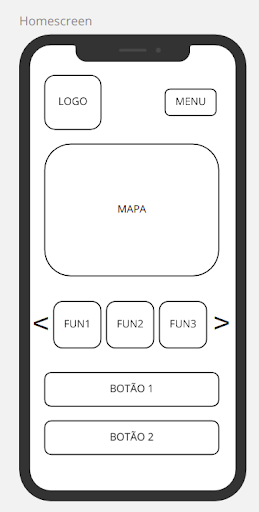
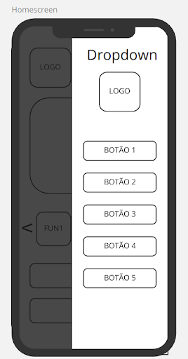
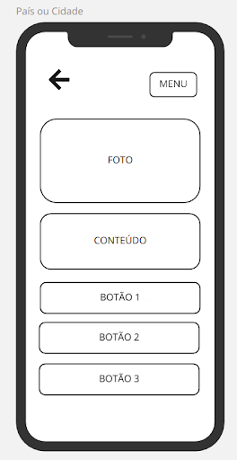
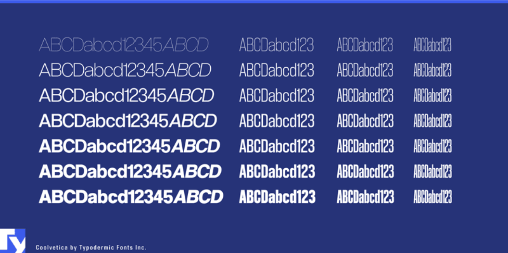
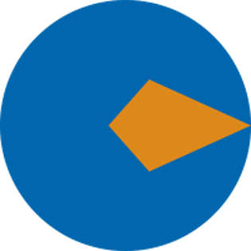
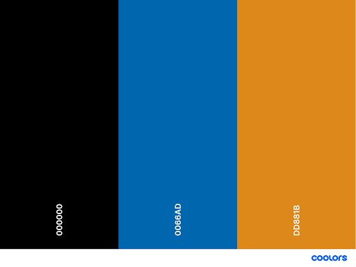

# Guia de Estilo
## 1. Introdução
O guia de estilo é um documento importante em IHC para incorporar decisões de design envolvendo os principais elementos e considerações de design de interface.

### 1.1. Objetivo do guia de estilo

O guia de estilo tem a função de reunir os princípios e diretrizes resultantes a partir das principais decisões de design tomadas, para que possam ser consultadas e reutilizadas a fim de incorporá-las no produto final.
Os guias de estilo servem como uma ferramenta de comunicação entre os membros da equipe de design e também com a equipe de desenvolvimento.

### 1.2. Organização e conteúdo do guia de estilo
	
O conteúdo e a organização deste guia de estilo seguirá a estrutura comum de Marcus, 1992; Mayhew, 1999, encontrada no livro Interação Humano-Computador da autora Simone Barbosa.

### 1.3. Público-alvo do guia de estilos (programadores, gerentes, equipe de suporte)
	
O público-alvo deste guia de estilo consiste nos alunos da Equipe 1 da disciplina de IHC, ministrada pelo professor Sergio. Os alunos irão desempenhar o papel de projetistas e desenvolvedores a fim de documentar no guia de estilo as decisões de design tomadas, garantindo a aplicação dessas decisões no produto final e em eventuais futuras versões.

### 1.4. Como utilizar o guia (em produção e manutenção)
	
Considerando o Princípio de Design adotado de Hartson e Hix, a cada etapa de Avaliação do ciclo de vida em estrela, deve ser verificado se o projeto segue os padrões deste guia de estilo. Este documento serve como guia para assegurar aos projetistas que estão construindo um produto coerente com os padrões de design adotados.
### 1.5. Como manter o guia
	
Qualquer atualização em decisões de design e estilo devem ser documentadas neste guia para auxiliar o time de projetistas a manter essas decisões até a entrega do produto final. Vale ressaltar que o guia de estilo deve ser uma fonte primária sobre a estilização do projeto.

## 2. Resultados de análise
### 2.1. Descrição do ambiente de trabalho do usuário

Não há um ambiente específico para a utilização do aplicativo desenvolvido, isso porque ele tem o intuito de se comportar como um Guia Turístico altamente interativo. Por conta disso, o usuário pode utilizar a aplicação em casa, na rua ou no escritório. Em qualquer lugar que ele possua acesso a internet junto de um smartphone, é possível fazer a consulta ao aplicativo e encontrar informações relevantes sobre o destino esperado.

## 3. Elementos de interface 

Aqui apresentaremos os principais componentes da interface da aplicação, assim como uma breve explicação da motivação de tais escolhas.

### 3.1. Disposição espacial e grid

A disposição espacial há de ser responsiva, de forma que diferentes indivíduos, por meio de diferentes dispositivos, possuam igual possibilidade de ter uma experiência plena e proveitosa do aplicativo e de suas funcionalidades.

#### 3.1.1. Homescreen

A homescreen vai apresentar a disposição acima. O menu será uma drawer que se expande ao clicar no botão. Já o mapa vai aparecer logo abaixo, seguido pelo carrossel de funcionalidades da última localização pesquisada (como restaurantes, pontos turísticos, conversão da moeda, dentre outras). Os botões 1 e 2 poderão assumir funcionalidades relevantes pensando no contexto da página (como pesquisar nova cidade ou abrir alguma página da internet com dicas).

#### 3.1.2. Painel do país ou cidade

A janela relacionada com a escolha de um país ou cidade terá a disposição acima. Haverá um botão para voltar para a janela anterior no canto superior esquerdo. Em seguida, haverá uma foto do local selecionado, sucedido pelo conteúdo dele (por exemplo, uma descrição do local, restaurante, ponto turístico, dentre outros). Por fim, há uma série de botões que podem assumir as funcionalidades mais adequadas no contexto do usuário.

### 3.2. Janelas

Para o processo de criação de janelas, há de ser feito um planejamento quanto à disposição de elementos e funcionalidades, de forma que haja uma interligação de atividades baseada em possíveis intenções do usuário.

### 3.3. Tipografia
       
A fonte a ser utilizada será a  Coolveltica, projetada por Raymond Larabie, com variações de cor e tamanho de acordo com o contexto e relevância das informações.
        

### 3.4. Símbolos não tipográficos

#### 3.4.1 Logotipo

#### 3.4.2 Isotipo

### 3.5. Cores

Por  meio de votação entre os integrantes, a maioria achou por bem fazermos uso de cores frias para a realização do design da aplicação. À priori, a paleta de cores base para a criação do projeto seria:

### 3.6. Animações 

A princípio, não foi decidido a respeito do uso de animações complexas, levando-se em conta o curto período do semestre, impossibilitando assim explorarmos em sua totalidade o potencial de gamificação da aplicação. Contudo, pequenas animações, relacionadas às insígnias e informações sobre os locais, podem ser eventualmente inseridas.

## 4. Elementos de interação

### 4.1. Estilos de interação

* Navbar: será uma barra horizontal para a navegação do usuário no website, possuirá Dropdowns, que serão explicados abaixo. Cada item da navbar será um link para a navegação.

* Dropdown: é um menu vertical, que possui um título que, ao ser clicado, abre a lista com os subitens.

* Botão: botões clicáveis com imagens que, ao ser clicado, leva o usuário até o conteúdo requerido

* Campo de pesquisa: campo utilizado pelo usuário para fazer pesquisa rápida de algum conteúdo, dentro do aplicativo.

* Cards: aqui serão os elementos que possuem geralmente uma imagem, pois podemos adicionar à essa imagem uma descrição. Ele pode ser tanto um link como um card explicativo, que poderá expandir para mostrar um conteúdo maior.

* Sliders: é um painel de conteúdos em que o seu conteúdo principal muda em um tempo determinado para dar lugar a outro conteúdo. Isso serve para mostrar conteúdos variados em um mesmo lugar para o usuário. O mesmo poderá navegar entre os conteúdos ou clicar para ser redirecionado à página deste conteúdo.

* Formulários: serão utilizados para login, para contato ou para qualquer outra atividade em que é necessário obter uma informação do usuário.

### 4.2. Seleção de um estilo

O estilo escolhido busca, principalmente, a padronização e organização do grupo em relação ao processo de criação do design da aplicação. Desta forma, a experiência do usuário será enriquecida, evitando com isso possíveis insatisfações quanto à organização do sistema.

### 4.3. Aceleradores (teclas de atalho)

Devido ao aplicativo ser mobile, a ferramenta de interação será o touchscreen do aparelho. Portanto, não há a necessidade de aceleradores.

## 5. Elementos de ação
### 5.1. Preenchimento de campos

Por meio do preenchimento dos campos disponíveis na aplicação, a troca de informações entre o usuário  (formulários de cadastro, feedbacks) e o sistema (informações a respeito dos locais) será recorrente e eficiente.
### 5.2. Seleção

Quanto à possibilidade de seleção, o usuário terá total possibilidade de usufruir das funcionalidades disponibilizadas pelo sistema. Contudo, algumas atividades como visualização de informações referentes ao perfil e realização de feedbacks ficarão restritas aos usuários que efetuarem o login.

### 5.3. Ativação

A questão da ativação no sistema será direcionada a 
partir de fundamentos de usabilidade, possibilitando a 
liberdade do usuário quando dentro da aplicação.

## 6. Vocabulário e padrões

### 6.1. Terminologia

Em conformidade à ideia e público centrais da aplicação, termos mais técnicos e complexos voltados para a área de tecnologia abrirão caminho para uma terminologia mais simples, a fim de tornar a aplicação mais intuitiva e enriquecer a experiência do usuário.

### 6.2. Tipos de tela (para tarefas comuns)

A aplicação deve contar com diversas telas, sejam elas mais gerais ou específicas, de forma tornar a aplicação mais intuitiva e, portanto, de fácil navegação. 

Quanto à disposição destas, a ideia da estrutura atual possui a seguinte composição: 

* Home
 
* Login

* Cadastro

* Recuperação de Senha

* Perfil

* Configurações

* Alterar dados pessoais

* Visualização de insígnias

* Visualização de Informações sobre o local
  - Visualizar descrição
  - Visualizar melhores opções de restaurantes, bares, etc
  - Visualizar histórico da cidade
  - Visualizar melhores pontos turísticos
  - Visualizar melhores épocas do ano
  - Conversão de moeda local 

* Feedback a respeito da cidade visitada