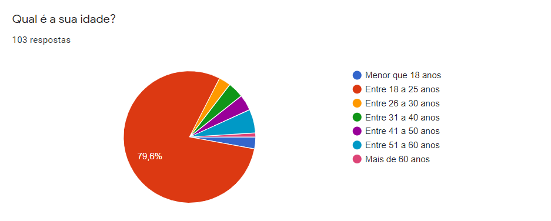
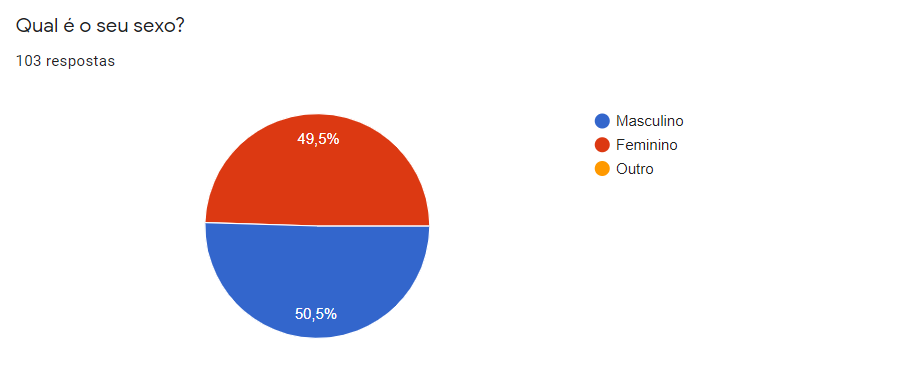
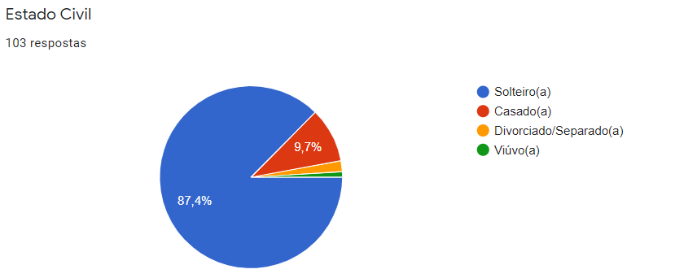
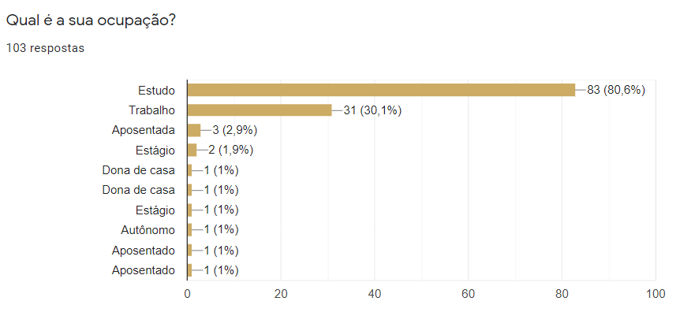
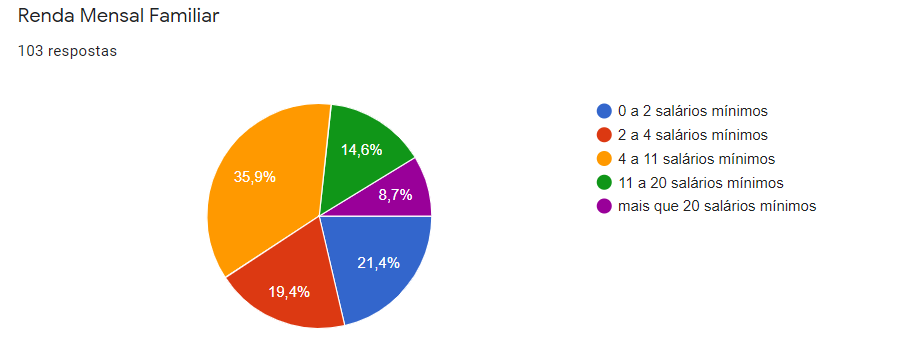
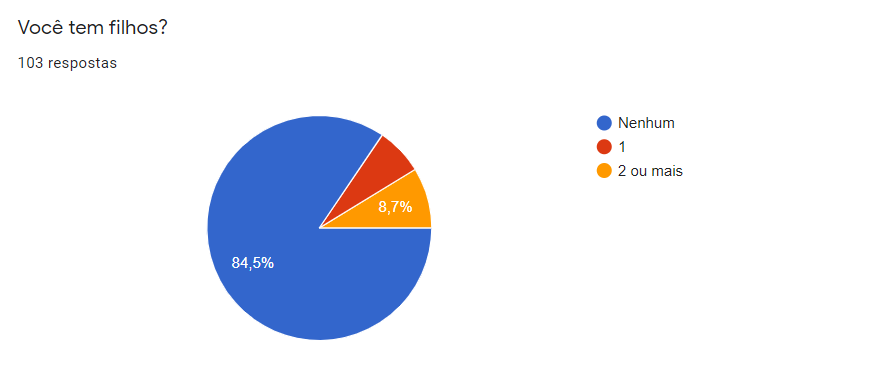
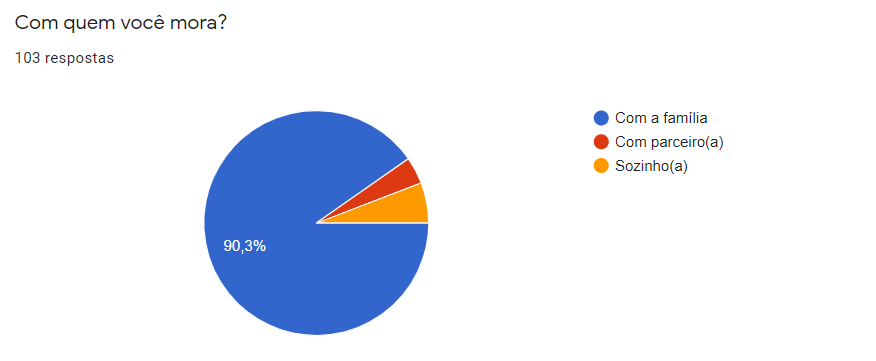
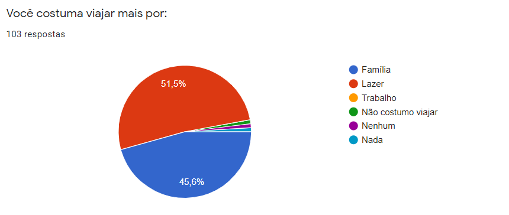
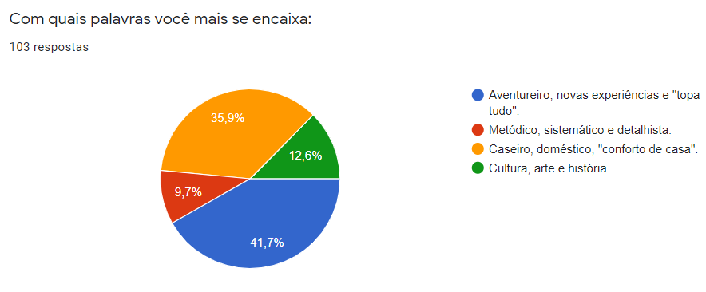

# Perfil de Usuário 

## Introdução

 &emsp;&emsp;
A fim de conseguir realizar uma análise de usuário bem consistente é importante fazer uma análise de diversos outros dados e fatores que nos permitem abordar e categorizar os usuários da plataforma, em que, de acordo com Courage e Baxter, o primeiro passo para registrarmos nosso entendimento sobre os usuários é traçarmos um perfil deles, realizando perguntas do tipo: Quem são? Quais são seus objetivos? e etc. Isso nos ajuda a entender para quem estamos construindo o produto, com isso em mente, o nosso grupo fez um questionário a fim de obter esses  dados. 

## Objetivo 

 &emsp;&emsp;
O objetivo deste documento é traçar um perfil de usuário com base nas pesquisas do público alvo para assim identificar de maneira clara as características e necessidades desses usuário

## Metodologia 

 &emsp;&emsp;
Nosso grupo realizou um questionário e o disponibilizou dos dias 18 até 20 de agosto de 2021. Escolhemos utilizar o formato de questionário devido a sua velocidade de coleta de dados, da grande quantidade de usuários que pode ser alcançada e a facilidade de analisar os dados que podem ser apresentados de forma gráfica.

 &emsp;&emsp;
Essa pesquisa foi acessada e respondida por cerca de 103 contas, assim criando um gráfico com a relação de usuários por sexo, faixa etária, renda familiar e etc, com isso foi possível chegar a certas conclusões quanto aos tipos de usuários alvos do aplicativo ***nome***.

## Questionário 

### IDADE DOS USUÁRIOS: 

	

### SEXO DOS USUÁRIOS:

	

### ESTADO CIVIL DOS USUÁRIOS:

	

### OCUPAÇÃO DOS USUÁRIOS:

	

### RENDA MENSAL FAMILIAR

	

### VOCÊ TEM FILHOS?

	

### COM QUEM VOCÊ MORA?

	

### COM QUE FREQUÊNCIA VOCÊ VIAJA?

	

### O USUÁRIO COSTUMA VIAJAR MAIS POR:

	

### O QUE OS USUÁRIOS PREFEREM UTILIZAR:

	

### QUAIS PALAVRAS MAIS SE ENCAIXAM AOS USUÁRIOS:

	

## Perfil de usuário
A partir de todos os dados acima, podemos traçar um perfil do usuário do aplicativo **nome**.

|Item |Descrição|
|-|-|
|Faixa etária|A faixa etária média ficou  entre 18 a 25 anos sendo 79,6%.|
|Sexo|Bem equilibrada possuindo apenas 0,5% de diferença entre homens e mulheres, em que no total teve 52 respostas de pessoas do sexo masculino e 51 do sexo feminino.|
|Estado Civil|A maioria se apresenta solteiro(a), em que apenas 13% das pessoas se apresentaram como casado(a), divorciado(a) ou viúvo(a)|
|Ocupação|80% dos usuários responderam estar ainda estudando em que o restante ficou entre Trabalhando/Estagiando ou aposentado.|
|Renda Mensal Familiar|35,9% dos usuários responderam entre 4 a 11, seguido de 0 a 2 salários mínimos respondido por 21,4% e depois de 2 0 a 4 por 19,4% dos usuários.|
|Você tem filhos?|A maioria apresenta não ter nenhum filho, em que apenas 6,8% marcaram que possui apenas 1 e 8,7% colocaram possuir 2 ou mais.|
|Com quem você mora?|A maioria dos usuários responderam que moram com a família, sendo representada por 90,3% do total, a outra porcentagem se dividiu parcialmente entre morar sozinho ou com o parceiro(a).|
|Frequência de viagem:|Com respostas mais divididas em que 45% viajam apenas uma vez por ano, 23,4% viajam 2 vezes por ano e 20,4% viajam 1 vez entre 2 anos.|
|Você costuma viajar mais por:|Viajar por Lazer foi a opção mais comum, sendo 51,5% porém 45,6% responderam viajar mais por família, interessantemente nenhum usuário respondeu viajar por trabalho, provavelmente sendo um fator que a maioria que respondeu o questionário ainda estar estudando.|
|Você prefere utilizar em viagens:|Por uma grande margem, as pessoas preferem viajar utilizando a internet e aplicativos, apresentando 86,4% do total, em que 11,7% não utilizam nada e surpreendentemente ninguém marcou que prefere utilizar guias e mapas físicos.|
|Com quais palavras você mais se encaixa:|Com duas respostas bem divididas a opção mais escolhida foi: Aventureiro, novas experiências e “topa tudo”, com 41,7% dos votos, porém logo em seguida os usuários marcaram a opção: Caseiro, Doméstico, “conforto de casa” .|

## Conclusão

 &emsp;&emsp;
Pode-se então concluir que a maioria dos usuários possuem entre 18 e 25 anos, tendo uma distribuição bem igual entre homens e mulheres, em que esses são  geralmente estudantes, solteiros(as) , sem filhos. Viajam apenas 1 vez ao ano, provavelmente por lazer e nessas viagens eles preferem utilizar aplicativos e a internet para poderem se guiar.

## Referências 
BARBOSA, Simone; SILVA, Bruno. "Interação Humano-Computador". Elsevier Editora Ltda, 2010.
COURAGE,C;BAXTER, K.Understanding your users: a practical guide to user requirements, methods, tools and technique. San Francisco. CA: Morgan Kaufmann Publishers 2005. 