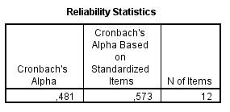

# Perfil de Usuário

## Introdução

A fim de conseguir realizar uma análise de usuário bem consistente é importante fazer uma análise de diversos outros dados e fatores que nos permitem abordar e categorizar os usuários da plataforma, em que, de acordo com Courage e Baxter, o primeiro passo para registrarmos nosso entendimento sobre os usuários é traçarmos um perfil deles, realizando perguntas do tipo: Quem são? Quais são seus objetivos? e etc. Isso nos ajuda a entender para quem estamos construindo o produto, com isso em mente, o nosso grupo fez um questionário a fim de obter esses dados.

## Objetivo

O objetivo deste documento é traçar um perfil de usuário com base nas pesquisas do público alvo para assim identificar de maneira clara as características e necessidades desses usuário

## Metodologia

Nosso grupo realizou um questionário e o disponibilizou dos dias 18 até 20 de agosto de 2021. Escolhemos utilizar o formato de questionário devido a sua velocidade de coleta de dados, da grande quantidade de usuários que pode ser alcançada e a facilidade de analisar os dados que podem ser apresentados de forma gráfica.

Essa pesquisa foi acessada e respondida por cerca de 103 contas, assim criando um gráfico com a relação de usuários por sexo, faixa etária, renda familiar e etc, com isso foi possível chegar a certas conclusões quanto aos tipos de usuários alvos do aplicativo **_nome_**.

## Questionário

### IDADE DOS USUÁRIOS:

### SEXO DOS USUÁRIOS:

### ESTADO CIVIL DOS USUÁRIOS:

### OCUPAÇÃO DOS USUÁRIOS:

### RENDA MENSAL FAMILIAR

### VOCÊ TEM FILHOS?

### COM QUEM VOCÊ MORA?

### COM QUE FREQUÊNCIA VOCÊ VIAJA?

### O USUÁRIO COSTUMA VIAJAR MAIS POR:

### O QUE OS USUÁRIOS PREFEREM UTILIZAR:

### QUAIS PALAVRAS MAIS SE ENCAIXAM AOS USUÁRIOS:

## Perfil de usuário

A partir de todos os dados acima, podemos traçar um perfil do usuário do aplicativo **nome**.

| Item                                     | Descrição                                                                                                                                                                                                                                                            |
| ---------------------------------------- | -------------------------------------------------------------------------------------------------------------------------------------------------------------------------------------------------------------------------------------------------------------------- |
| Faixa etária                             | A faixa etária média ficou entre 18 a 25 anos sendo 79,6%.                                                                                                                                                                                                           |
| Sexo                                     | Bem equilibrada possuindo apenas 0,5% de diferença entre homens e mulheres, em que no total teve 52 respostas de pessoas do sexo masculino e 51 do sexo feminino.                                                                                                    |
| Estado Civil                             | A maioria se apresenta solteiro(a), em que apenas 13% das pessoas se apresentaram como casado(a), divorciado(a) ou viúvo(a)                                                                                                                                          |
| Ocupação                                 | 80% dos usuários responderam estar ainda estudando em que o restante ficou entre Trabalhando/Estagiando ou aposentado.                                                                                                                                               |
| Renda Mensal Familiar                    | 35,9% dos usuários responderam entre 4 a 11, seguido de 0 a 2 salários mínimos respondido por 21,4% e depois de 2 0 a 4 por 19,4% dos usuários.                                                                                                                      |
| Você tem filhos?                         | A maioria apresenta não ter nenhum filho, em que apenas 6,8% marcaram que possui apenas 1 e 8,7% colocaram possuir 2 ou mais.                                                                                                                                        |
| Com quem você mora?                      | A maioria dos usuários responderam que moram com a família, sendo representada por 90,3% do total, a outra porcentagem se dividiu parcialmente entre morar sozinho ou com o parceiro(a).                                                                             |
| Frequência de viagem:                    | Com respostas mais divididas em que 45% viajam apenas uma vez por ano, 23,4% viajam 2 vezes por ano e 20,4% viajam 1 vez entre 2 anos.                                                                                                                               |
| Você costuma viajar mais por:            | Viajar por Lazer foi a opção mais comum, sendo 51,5% porém 45,6% responderam viajar mais por família, interessantemente nenhum usuário respondeu viajar por trabalho, provavelmente sendo um fator que a maioria que respondeu o questionário ainda estar estudando. |
| Você prefere utilizar em viagens:        | Por uma grande margem, as pessoas preferem viajar utilizando a internet e aplicativos, apresentando 86,4% do total, em que 11,7% não utilizam nada e surpreendentemente ninguém marcou que prefere utilizar guias e mapas físicos.                                   |
| Com quais palavras você mais se encaixa: | Com duas respostas bem divididas a opção mais escolhida foi: Aventureiro, novas experiências e “topa tudo”, com 41,7% dos votos, porém logo em seguida os usuários marcaram a opção: Caseiro, Doméstico, “conforto de casa” .                                        |

## Alfa de Cronbach

Antes de descrevermos o processo por nós utilizado para o cálculo do Alfa de Cronbach, é importante que o conceituemos  e apresentemos a importância de sua aplicabilidade para o projeto. 

O coeficiente alfa de Cronbach foi apresentado por Lee J. Cronbach, em 1951, como uma forma de estimar a confiabilidade de um questionário aplicado em uma pesquisa. Ele mede a correlação entre respostas em um questionário através da análise das respostas dadas pelos respondentes, apresentando uma correlação média entre as perguntas. O coeficiente α é calculado a partir da variância dos itens individuais e da variância da soma dos itens de cada avaliador de todos os itens de um questionário que utilizem a mesma escala de medição.

Para a realização do cálculo do coeficiente, é necessário primeiro que as respostas passem por um processo de avaliação. Corriqueiramente, tal processo é efetuado por meio da escala Likert, na qual as respostas obtidas possuem um valor de 1 a 5, atribuído com base em critérios como concordância, frequência, importância, satisfação,prioridades e vários outros.

Levando-se em conta que não se trata de um questionário avaliativo, mas sim de análise do perfil de usuário mais comum entre as respostas, achamos por bem atribuir a pontuação de acordo com o nível de aparição das respostas dentro do questionário.

Para facilitar o processo de cálculo, organizamos em uma tabela as pontuações referentes às respostas obtidas da seguinte maneira: 

Como pode-se perceber, seria uma tarefa muito difícil realizar manualmente os cálculos da 103 respostas sem obter nenhum erro. Por isso, fizemos uso do software "IBM SPSS",uma potente plataforma de software estatístico. Entrega um conjunto robusto de recursos que permitem que uma determinada empresa ou indivíduo extraia insights acionáveis a partir de seus dados.

### IBM SPSS

Com o auxíĺio deste potente software, o cálculo do Alfa de Cronbach tornou-se automatizado e de fácil compreensão, evitando assim eventuais erros humanos:

O resultado obtido (0,573) representa um resultado de confiabilidade moderado. Isso se dá pela variação encontrada no que diz respeito à atribuição de pontuação para cada resposta. É um resultado compreensível, tendo em vista a flexbilização de critérios para a realização dos cálculos, além da grande quantidade de respostas obtidas.   

Além deste importante resultado, o "IBM SPSS" possibilitou a obtenção de outros importantes cálculos como a análise descritiva de valores médios da tabela, itens estatísticos como média e desvio padrão, tabela de correlação das pontuações e possíveis resultados a partir da exclusão de um item:

* Análise Descritiva:

* Itens Estatísticos (Média e Desvio Padrão) :

* Tabela de Correlação:

* Resultados a partir da exclusão de um item:

## Conclusão

Pode-se então concluir que a maioria dos usuários possuem entre 18 e 25 anos, tendo uma distribuição bem igual entre homens e mulheres, em que esses são geralmente estudantes, solteiros(as) , sem filhos. Viajam apenas 1 vez ao ano, provavelmente por lazer e nessas viagens eles preferem utilizar aplicativos e a internet para poderem se guiar.

## Referências

> BARBOSA, Simone; SILVA, Bruno. "Interação Humano-Computador". Elsevier Editora Ltda, 2010.

> COURAGE,C;BAXTER, K.Understanding your users: a practical guide to user requirements, methods, tools and technique. San Francisco. CA: Morgan Kaufmann Publishers 2005.
