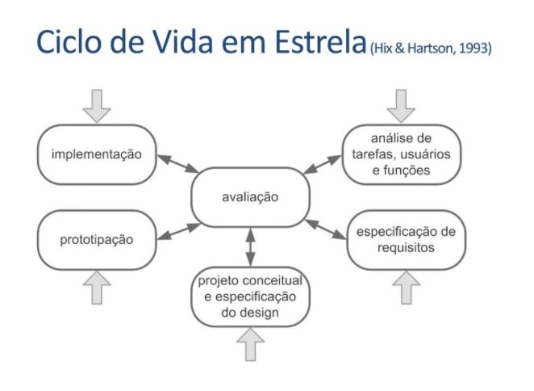
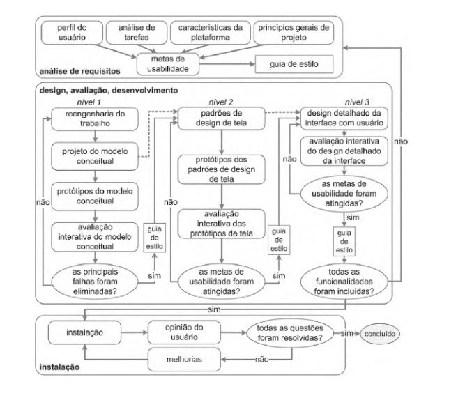

# Processos de Design

## O que é?

&emsp;&emsp; Para definirmos nosso processo de design, é necessário antes saber do que se trata. Então vamos lá, um processo podemos entender como tudo aquilo que tem andamento, desenvolvimento, uma sequência de fatos que em algum momento atinge o objetivo. Já o design é a “aplicação da criatividade humana para um propósito”. 

 
&emsp;&emsp;A ideia de Processo de Design surge como uma nova forma de resolver problemas, trazendo sempre uma ou mais soluções. É de suma importância que a ideia de processo esteja sempre clara, pois é a partir dela que nós saberemos o que já foi feito e o que se deve ainda fazer.

 
&emsp;&emsp;Além disso, durante um Processo de Design deve-se sempre manter o foco em resolver o problema, e não nas possíveis soluções. A partir daí, é normal que os resultados sejam muitas vezes imprevisíveis ou numerosos.

## Ciclo de Vida em Estrela

&emsp;&emsp;Esse Processo de Design, proposto por Hix e Hartson em 1993, tem como o principal diferencial a constante avaliação, ou seja, entre todas as etapas do ciclo de vida do projeto é realizada uma análise do que foi feito, caso não esteja satisfatório, retornamos para as etapas anteriores e melhoramos.

&emsp;&emsp; Esse foi o processo escolhido pelo time, por ser bastante versátil e eficiente em IHC.

**Análise de tarefas, usuários e funções:**é quando se toma consciência da situação atual, das necessidades e oportunidades de melhora.

**Especificação de requisitos:** define-se o problema e os requisitos para sua resolução.

**Projeto conceitual e especificação do design:** onde a solução de IHC é concebida.

**Prototipação:** criação de protótipos que serão testados e avaliados.

**Implementação:** é quando o sistema interativo final é desenvolvido.

**Avaliação:** Avaliação e análise presente entre todas as etapas do processo.

&emsp;&emsp;Alguns exemplos de processos de design:

&emsp;&emsp;Falando de IHC um dos processos de design mais famosos e utilizados é o de Mayhem que é formado por um uma sequência de etapas que podem se sobrepor ou iterar, conforme o escopo do projeto. O processo é dividido em  3 fases principais:

## Análise de Requisitos

&emsp;&emsp; Na fase de análise de requisitos são definidas as metas de usabilidade com base no perfil dos usuários, análise de tarefas, possibilidades e limitações da  plataforma em que o sistema será executado e princípios gerais de design de IHC.

## Design, Avaliação e Desenvolvimento

 
&emsp;&emsp;Essa fase tem como objetivo projetar, em três níveis de detalhes, as soluções de IHC tendo como objetivo conceber uma solução que atenda os requisitos estabelecidos anteriormente. Durante o desenvolvimento a interface deve ser avaliada com os usuários

## Instalação

 
&emsp;&emsp;Neste ciclo o designer deve coletar opiniões dos usuários depois de algum tempo de uso.Esses feedbacks serão úteis para melhorar o sistema em versões futuras.

## Porque não escolhemos esse modelo:

 
&emsp;&emsp;É inflexível e burocrático, onde as atividades e sua ordem são bem determinadas, sendo assim complicado encaixar esse modelo no nosso cronograma sendo necessária uma refatoração  geral do mesmo.

  
&emsp;&emsp;Com isso, nosso grupo preferiu utilizar o processo de design do ciclo de vida da estrela sendo mais flexível e simples, dando mais liberdade  nas ações, mas mesmo assim mantendo a qualidade, através das avaliações contínuas que o ciclo oferece a cada término de atributo.

