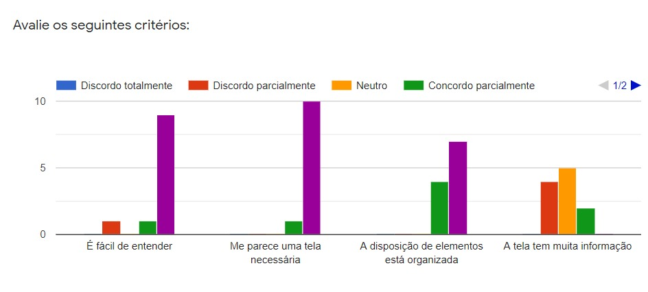
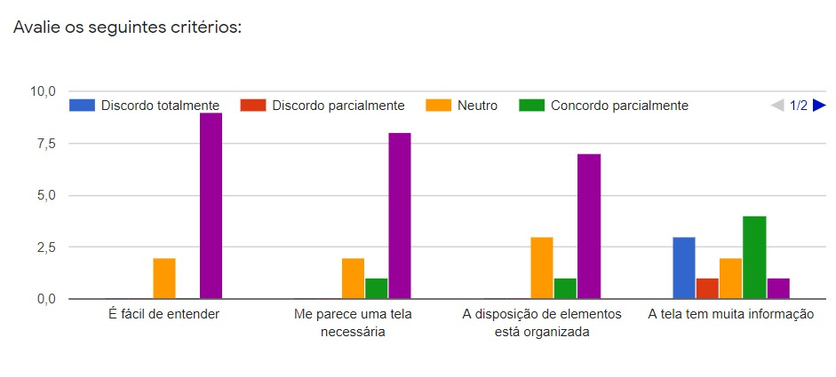
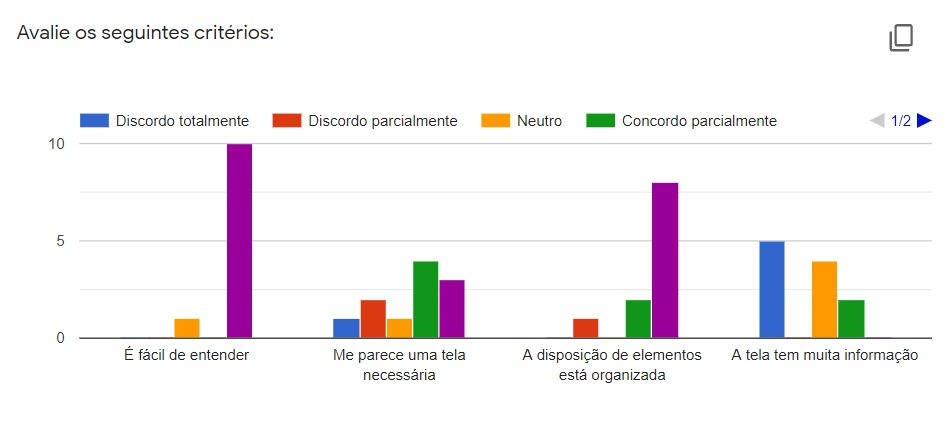
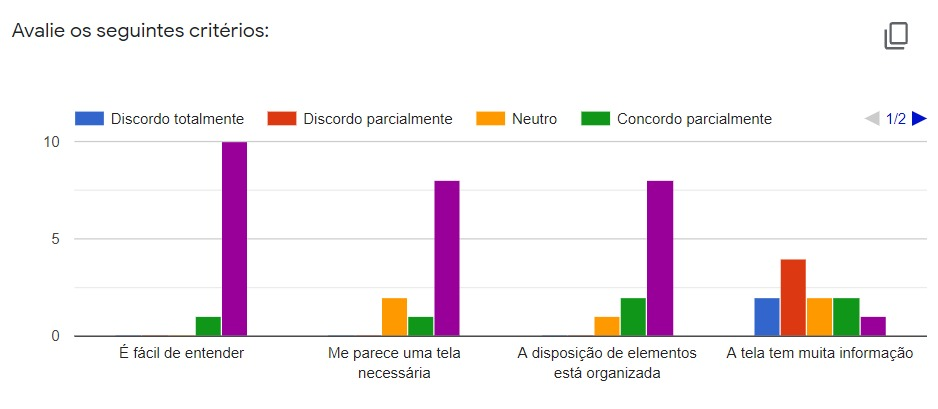
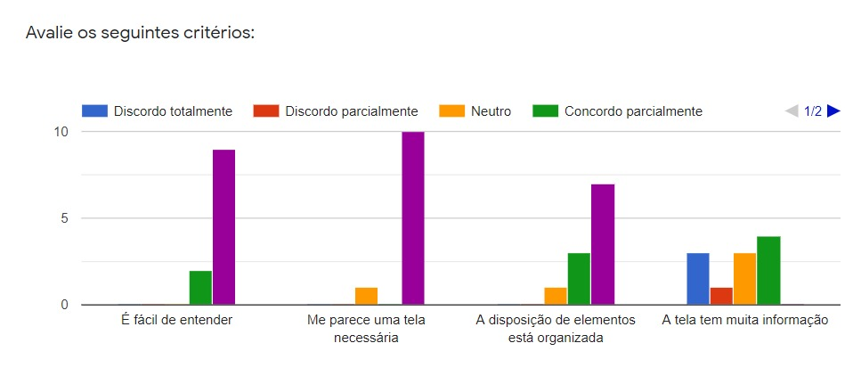
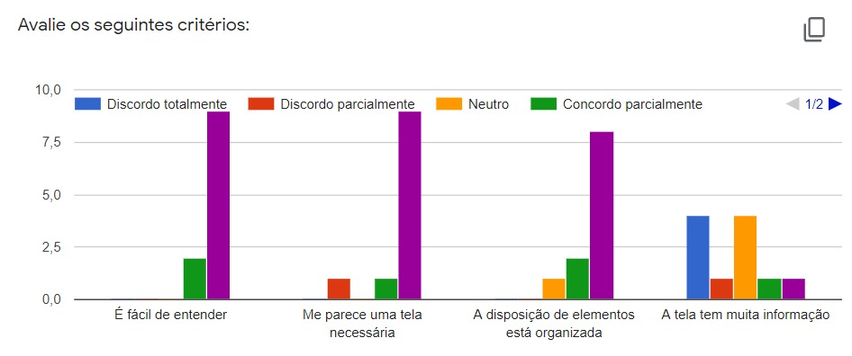
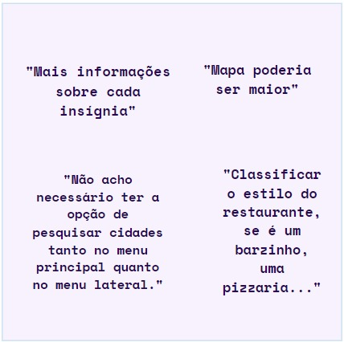

# Prótotipo de Papel

## Introdução

&emsp;&emsp; O método de prototipação em papel  é uma forma de avaliação da usabilidade de um design de IHC em papel onde através da participação dos potenciais usuários serão realizadas simulações no protótipo.(Snyder ,2003)

 
&emsp;&emsp;Simular o uso em papel é um modo rápido e barato de identificar problemas de usabilidade antes mesmo de construir uma solução executável. Em que devido sua capacidade de rápida e baixo custo de produção se torna uma opção interessante para uma avaliação formativa junto aos usuários, principalmente para comparar alternativas de design,  sendo assim  ótimos instrumentos de proof-of-concepts.(BARBOSA e SILVA, 2010).

## Objetivo

&emsp;&emsp; O objeto da protótipação em papel para o nosso projeto, é demonstrar como o usuário poderá utilizar o sistema, demonstrando os passos que ele segue para concluir determinada tarefa, logo depois realizar uma análise externa para obter informações e opniões para  validar esse protótipo, assim  analisando sugestões e preferências dos usários acerca das funcionalidades e interação.

## Metodologia

&emsp;&emsp; Novamente optamos por utilizar um questionário para avaliação de uma etapa do nosso projeto, dessa vez o do Prótotipo de papel . A facilidade da coleta e análise de dados foi o motivo de termos utilizado o Google Forms nesse processo.

&emsp;&emsp; No total, 11 contas responderam o forms, menos que as anteriores devido a maior complexidade do questionaŕio, pórem o suficiente para poder desenvolver uma análise dos resultado.

## Prótotipo de Papel no Figma

<iframe style="border: 1px solid rgba(0, 0, 0, 0.1);" width="800" height="450" src="https://www.figma.com/embed?embed_host=share&url=https%3A%2F%2Fwww.figma.com%2Ffile%2FMMQCF4ObxVbNVLFf2B30JC%2FUntitled%3Fnode-id%3D0%253A1" allowfullscreen></iframe>

## Questionário

&emsp;&emsp; Nesse Questionário nosso grupo decidiu realizar uma metodologia diferente no intuito de conseguir análisar cada tela do prótotipo de papel de uma forma mais precisa e eficaz, em que o usário primeramente visualiza a tela, depois a pontua em um valor de 1 à 5 e se ela achar necessário ou querer contribuir mais com o projeto ela poderá deixar um comentaŕio sobre suas opniões. A pontuação e os critérios foram definidos nesses fatores:

### CRITÉRIOS:

    - É fácil de entender?
    - Me parece uma tela necessária.
    - A disposição de elementos está organizada?
    - A tela tem muita informação

### PONTUAÇÃO:

    - DISCORDO TOTALMENTE -  1 PONTO
    - DISCORDO PARCIALMENTE - 2 PONTOS
    - NEUTRO - 3 PONTOS
    - CONCORDO PARCIALMENTE - 4 PONTOS
    - CORCONDO TOTALMENTE - 5 PONTOS

## GRÁFICOS

### Perfil de Usuário:

### Homescreen:

### Menu:

### Pesquisar continente:

### Pesquisar país:

### Pesquisar cidade:

### Informações da cidade:

### Ver restaurantes:

### Ver pontos turísticos:

### Conversão de moeda:

## Comentários:

## Conclusão

&emsp;&emsp; Pode-se então concluir que o prótipo de papel foi bem visto e aceito pelo público e o questionário é valido para análise, com o alfa de cronbach dando 0,87, assim analisando os gráficos e os comentários pode-se dizer que todos os critérios avaliados foram aceitos e validados pelo público, contudo o críterio que os usários mais reclamaram foi em relação a tela ter muita informação, algo que nosso grupo tem que avaliar no protipo de alta.

## Referências

> Livro: BARBOSA, S. D. J.; SILVA, B. S. Interação Humano-Computador. 1ª edição, Rio de Janeiro: Elsevier, 2010.

> Preece, J.; Roger, Y.; Sharp, H. Design de Interação: Além da Interação Humano-Computador. Bookman, 3º ed. 2013.
