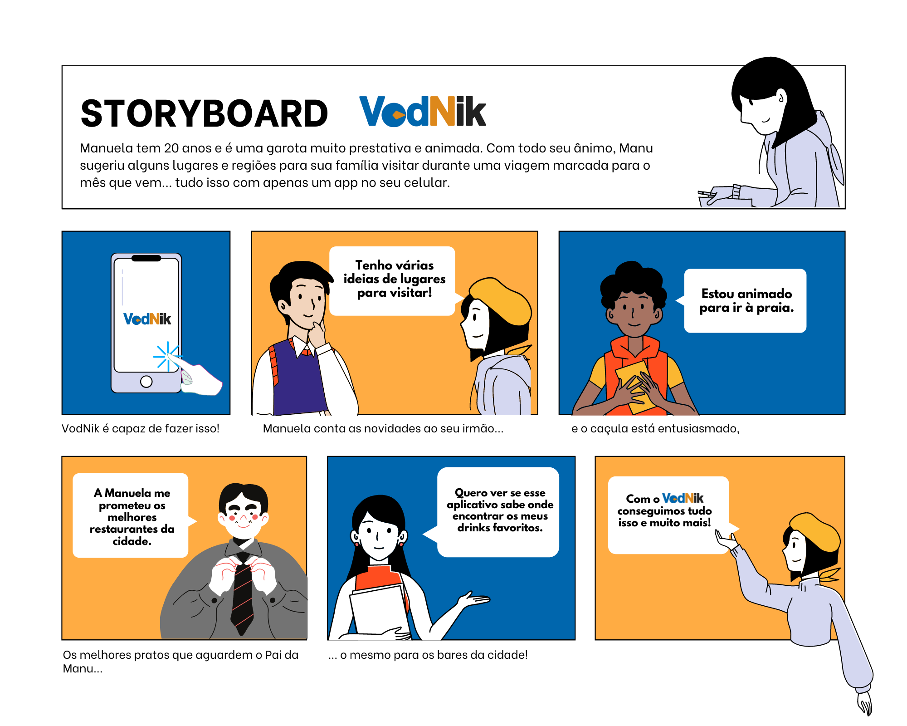
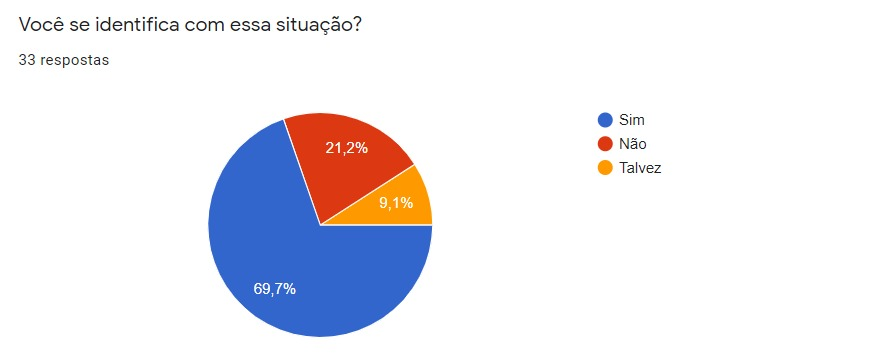
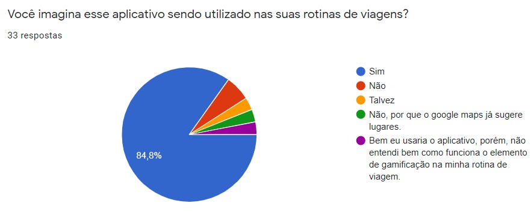
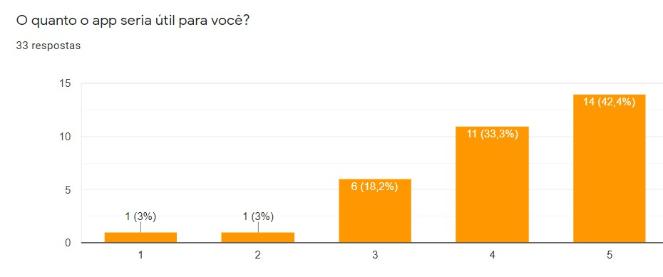
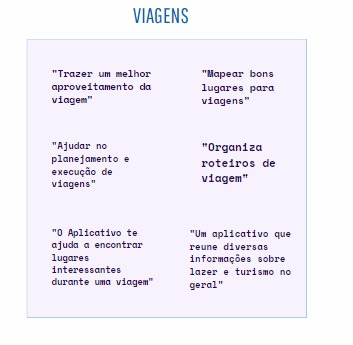
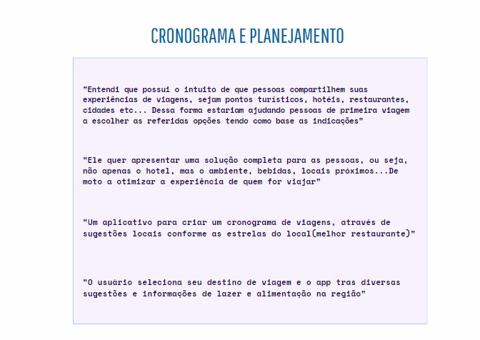
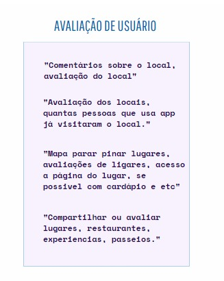
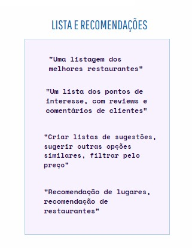
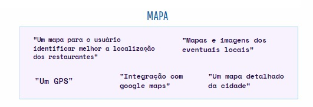
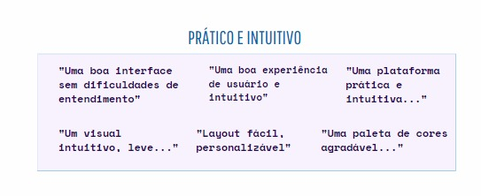

# Perfil de Usuário

## Introdução

Storyboard é uma tecnica que utiliza uma sequência de desenhos ou ilustrações que representam estados da interface ao longo do caminho de interação do cliente com o sistema.

## Objetivo

- Compreender o que público entendeu da proposta do aplicativo, após a análise do Storyboard.

- Analisar sugestões e preferências do público acerca das funcionalidades e interação.

## Metodologia

Novamente optamos por utilizar um questionário para avaliação de uma etapa do nosso projeto, dessa vez o Storyboard. A facilidade da coleta e análise de dados foi o motivo de termos utilizado o Google Forms nesse processo.

No total, 33 contas responderam o forms.

## Storyboard

## Questionário

### Você se identifica com essa situação?:

### Você imagina esse aplicativo sendo utilizado nas suas rotinas de viagens?:

### O quanto o app seria útil para você?:

### Após a análise do Storyboard, o que você compreende da proposta do aplicativo?:

### A partir do Storyboard, quais funcionalidades você imagina ou desejaria ter no aplicativo?:

### O que você acha que seria bom ter no aplicativo para torna-lo mais interativo e agradável de usar?:

## Perfil de usuário

A partir de todos os dados acima, podemos traçar um perfil do usuário do aplicativo **nome**.

| Item                                     | Descrição                                                                                                                                                                                                                                                            |
| ---------------------------------------- | -------------------------------------------------------------------------------------------------------------------------------------------------------------------------------------------------------------------------------------------------------------------- |
| Faixa etária                             | A faixa etária média ficou entre 18 a 25 anos sendo 79,6%.                                                                                                                                                                                                           |
| Sexo                                     | Bem equilibrada possuindo apenas 0,5% de diferença entre homens e mulheres, em que no total teve 52 respostas de pessoas do sexo masculino e 51 do sexo feminino.                                                                                                    |
| Estado Civil                             | A maioria se apresenta solteiro(a), em que apenas 13% das pessoas se apresentaram como casado(a), divorciado(a) ou viúvo(a)                                                                                                                                          |
| Ocupação                                 | 80% dos usuários responderam estar ainda estudando em que o restante ficou entre Trabalhando/Estagiando ou aposentado.                                                                                                                                               |
| Renda Mensal Familiar                    | 35,9% dos usuários responderam entre 4 a 11, seguido de 0 a 2 salários mínimos respondido por 21,4% e depois de 2 0 a 4 por 19,4% dos usuários.                                                                                                                      |
| Você tem filhos?                         | A maioria apresenta não ter nenhum filho, em que apenas 6,8% marcaram que possui apenas 1 e 8,7% colocaram possuir 2 ou mais.                                                                                                                                        |
| Com quem você mora?                      | A maioria dos usuários responderam que moram com a família, sendo representada por 90,3% do total, a outra porcentagem se dividiu parcialmente entre morar sozinho ou com o parceiro(a).                                                                             |
| Frequência de viagem:                    | Com respostas mais divididas em que 45% viajam apenas uma vez por ano, 23,4% viajam 2 vezes por ano e 20,4% viajam 1 vez entre 2 anos.                                                                                                                               |
| Você costuma viajar mais por:            | Viajar por Lazer foi a opção mais comum, sendo 51,5% porém 45,6% responderam viajar mais por família, interessantemente nenhum usuário respondeu viajar por trabalho, provavelmente sendo um fator que a maioria que respondeu o questionário ainda estar estudando. |
| Você prefere utilizar em viagens:        | Por uma grande margem, as pessoas preferem viajar utilizando a internet e aplicativos, apresentando 86,4% do total, em que 11,7% não utilizam nada e surpreendentemente ninguém marcou que prefere utilizar guias e mapas físicos.                                   |
| Com quais palavras você mais se encaixa: | Com duas respostas bem divididas a opção mais escolhida foi: Aventureiro, novas experiências e “topa tudo”, com 41,7% dos votos, porém logo em seguida os usuários marcaram a opção: Caseiro, Doméstico, “conforto de casa” .                                        |

## Conclusão

Pode-se então concluir que a proposta foi bem clara, em que a proposta do projeto foi bem apresentada através do Storyboard. De acordo com a pesquisa, o aplicativo seria útil e usado pelos viajantes e as principais mais funcionalidades exigidas pelos usuários foram: os Mapas, as Avaliações e Feedbacks e as Listas, sugestões e recomendações, e por fim os aspectos de interação mais comentados foram: a praticidade, a facilidade e a Intuitividade.

## Referências

> BARBOSA, Simone; SILVA, Bruno. "Interação Humano-Computador". Elsevier Editora Ltda, 2010.

> COURAGE,C;BAXTER, K.Understanding your users: a practical guide to user requirements, methods, tools and technique. San Francisco. CA: Morgan Kaufmann Publishers 2005.
