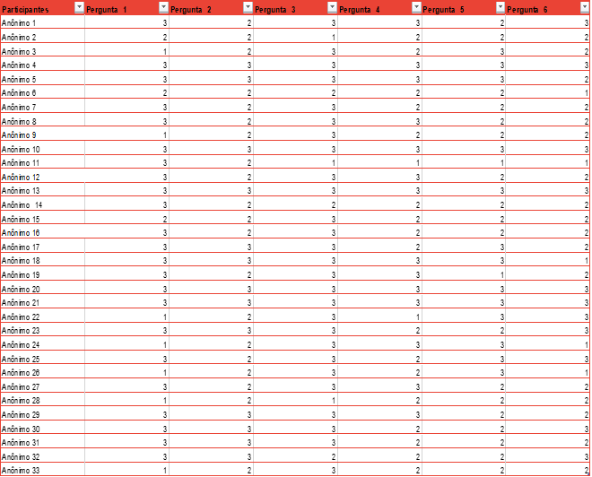
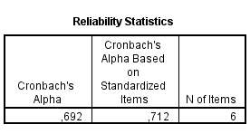
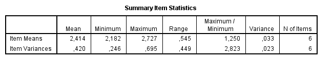
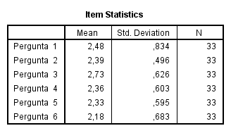
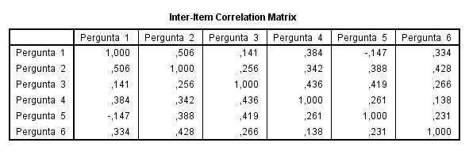
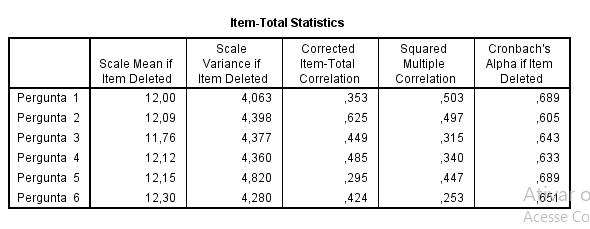

# Perfil de Usuário

## Introdução

Storyboard é uma tecnica que utiliza uma sequência de desenhos ou ilustrações que representam estados da interface ao longo do caminho de interação do cliente com o sistema.

## Objetivo

- Compreender o que público entendeu da proposta do aplicativo, após a análise do Storyboard.

- Analisar sugestões e preferências do público acerca das funcionalidades e interação.

## Metodologia

Novamente optamos por utilizar um questionário para avaliação de uma etapa do nosso projeto, dessa vez o Storyboard. A facilidade da coleta e análise de dados foi o motivo de termos utilizado o Google Forms nesse processo.

No total, 33 contas responderam o forms.

## Storyboard

## Questionário

### Você se identifica com essa situação?:

### Você imagina esse aplicativo sendo utilizado nas suas rotinas de viagens?:

### O quanto o app seria útil para você?:

### Após a análise do Storyboard, o que você compreende da proposta do aplicativo?:

### A partir do Storyboard, quais funcionalidades você imagina ou desejaria ter no aplicativo?:

### O que você acha que seria bom ter no aplicativo para torna-lo mais interativo e agradável de usar?:

## Alfa de Cronbach

Antes de descrevermos o processo por nós utilizado para o cálculo do Alfa de Cronbach, é importante que o conceituemos  e apresentemos a importância de sua aplicabilidade para o projeto. 

O coeficiente alfa de Cronbach foi apresentado por Lee J. Cronbach, em 1951, como uma forma de estimar a confiabilidade de um questionário aplicado em uma pesquisa. Ele mede a correlação entre respostas em um questionário através da análise das respostas dadas pelos respondentes, apresentando uma correlação média entre as perguntas. O coeficiente α é calculado a partir da variância dos itens individuais e da variância da soma dos itens de cada avaliador de todos os itens de um questionário que utilizem a mesma escala de medição.

Para a realização do cálculo do coeficiente, é necessário primeiro que as respostas passem por um processo de avaliação. Corriqueiramente, tal processo é efetuado por meio da escala Likert, na qual as respostas obtidas possuem um valor de 1 a 5, atribuído com base em critérios como concordância, frequência, importância, satisfação,prioridades e vários outros.

Levando-se em conta a natureza das respostas deste questionário, atribuímos pontuações de 1 a 3 para cada uma obtida. Tais pontuações foram atribuídas com base no nível concordância de cada resposta dentro do questionário.

Para facilitar o processo de cálculo, organizamos em uma tabela as pontuações referentes às respostas obtidas da seguinte maneira: 

Como pode-se perceber, seria uma tarefa muito difícil realizar manualmente os cálculos da 33 respostas sem obter nenhum erro. Por isso, fizemos uso de dois importantes softwares: IBM SPSS e RStudio, potentes plataformas de software estatístico.

### IBM SPSS

Com o auxíĺio deste potente software, o cálculo do Alfa de Cronbach tornou-se automatizado e de fácil compreensão, evitando assim eventuais erros humanos:

O resultado obtido (0,712) evidencia um resultado de confiabilidade considerado bom. Isso se dá pela pouca variação encontrada no que diz respeito à atribuição de pontuação para cada resposta. Desta forma, o questionário pode ser considerado válido para a realização de uma futura avaliação.

Além deste importante resultado, o "IBM SPSS" possibilitou a obtenção de outros importantes cálculos como a análise descritiva de valores médios da tabela, itens estatísticos como média e desvio padrão, tabela de correlação das pontuações e possíveis resultados a partir da exclusão de um item:

* Análise Descritiva:

* Itens Estatísticos (Média e Desvio Padrão) :

* Tabela de Correlação:

* Resultados a partir da exclusão de um item:

## Conclusão

Pode-se então concluir que a proposta foi bem clara, em que a proposta do projeto foi bem apresentada através do Storyboard. De acordo com a pesquisa, o aplicativo seria útil e usado pelos viajantes e as principais mais funcionalidades exigidas pelos usuários foram: os Mapas, as Avaliações e Feedbacks e as Listas, sugestões e recomendações, e por fim os aspectos de interação mais comentados foram: a praticidade, a facilidade e a Intuitividade.

## Referências

> BARBOSA, Simone; SILVA, Bruno. "Interação Humano-Computador". Elsevier Editora Ltda, 2010.

> COURAGE,C;BAXTER, K.Understanding your users: a practical guide to user requirements, methods, tools and technique. San Francisco. CA: Morgan Kaufmann Publishers 2005.
